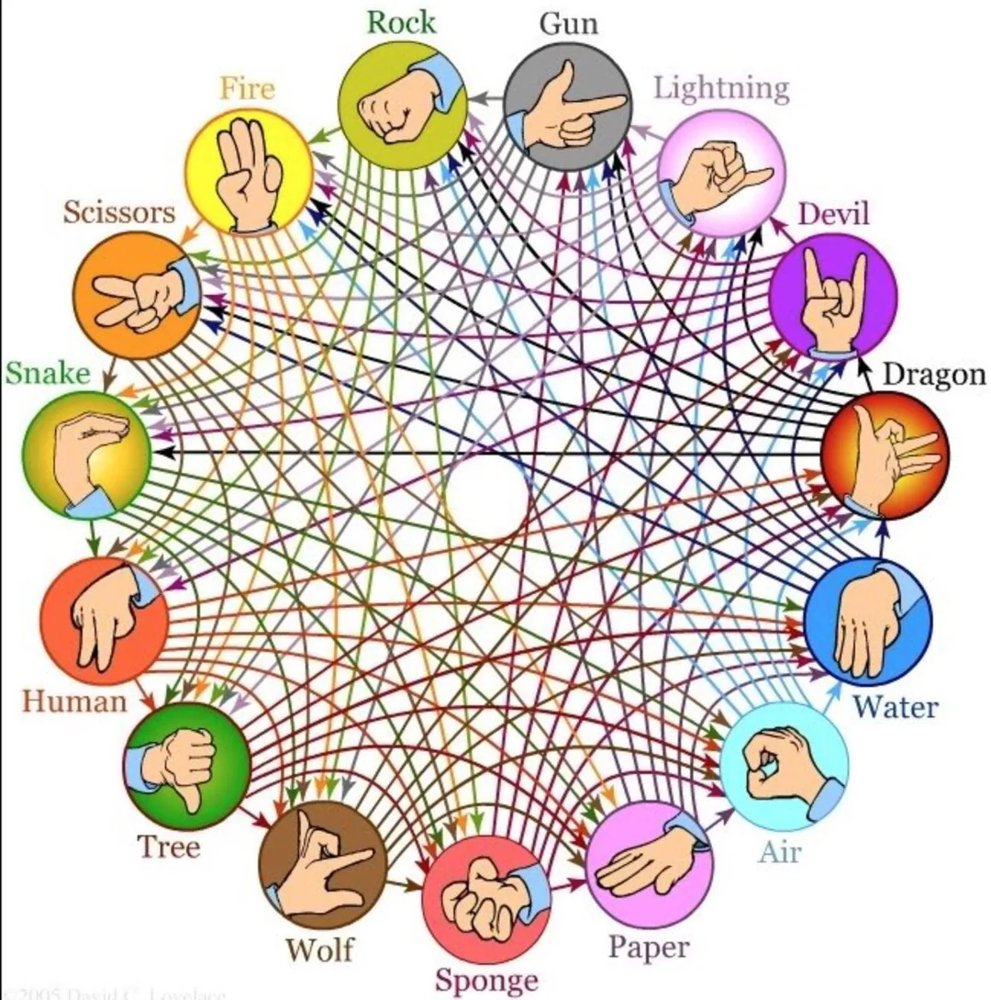

# rps-discord-bot

This bot allows you to play an extended version of rock paper scissors on your discord server.
Use the command `!rps` to initialize a game.

The game is inspired by this [reddit post](https://www.reddit.com/r/coolguides/comments/cauhw3/ultimate_rock_paper_scissors/).
The code is written in [Python](https://www.python.org/), and uses the [discord.py](https://discordpy.readthedocs.io/en/stable/) API wrapper.
